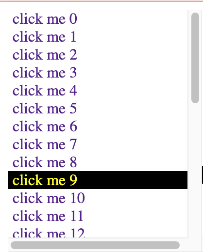

# HTML SelectionInList widget

A widget to display items in a list. Each item can:
- be selected
- be de-selected
- produced an event on selection
- up and down arrow keys

## usage

    <selection-in-list id="list1"/>

    let list1 = document.querySelector('#list1');
    for (let i = 0; i < 30; i++) {
        list1.addItem('click me '+i,'click me '+i);
    }
    list1.addEventListener('selection', function(which) {
        console.log('list1:', which.detail);
    });

## todo

- tab should leave widget
- add context menu
- how to show icon next to label (lead,tail)
- search in list
- on key up/down, the content shifts left
- tested on Chrome only

###

MIT License. https://ernestmicklei.com